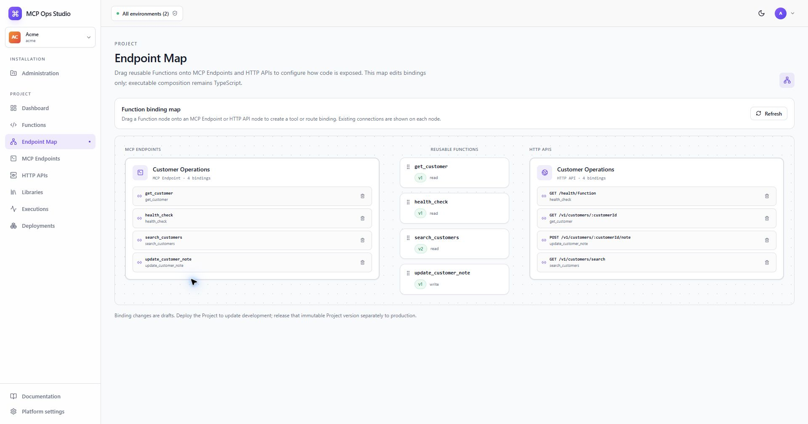
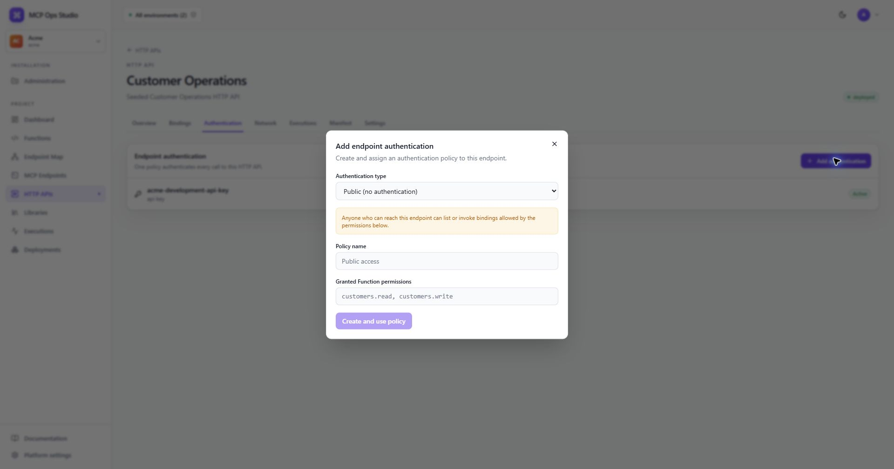
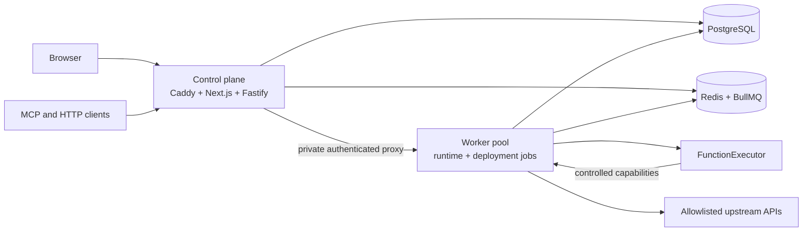

# MCP Ops Studio

MCP Ops Studio is a self-hosted platform for turning TypeScript functions into
MCP servers and HTTP APIs.

[Explore the documentation homepage](https://fabian-arnold.github.io/McpOpsStudio/)
or continue below for the repository quick start.

For a retained self-hosted installation, use the
[Docker Compose installation guide](docs/installation.md) and pin a tagged
release. The quick start below builds the current source tree for development.

It is useful when an application already has an API, but that API is not suitable
for agents or downstream services as-is. The upstream API may use the wrong
authentication method, return data in an inconvenient shape, expose too much
data, require several calls, or lack caching and access controls. MCP Ops Studio
adds a small, code-first translation layer without changing the source system.

Write the adaptation in TypeScript, test it in the browser, bind it to one or
more MCP Endpoints or HTTP APIs, and deploy an immutable project version.

## Screenshots

### Connect Functions to endpoints

Drag reusable Function nodes onto MCP Endpoints or HTTP APIs. The map configures
exposure only; application logic stays in TypeScript.



### Adapt authentication

Endpoints support API keys, bearer tokens, HTTP Basic, JWT, Entra ID, webhook
signatures, and an explicit public/no-auth policy.



## What it provides

- A Monaco-based TypeScript Function editor with schema-aware autocomplete.
- Reusable project Functions that can be exposed from multiple endpoints.
- Remote MCP tools over stateless Streamable HTTP.
- JSON HTTP routes for webhooks, internal APIs, and service integrations.
- Authentication translation using encrypted credential Secrets.
- Input/output validation and response reshaping.
- Restricted outbound HTTP with host, method, port, timeout, and size policies.
- Function-scoped PostgreSQL storage and Redis caching.
- Immutable development deployments, production releases, and rollback.
- Execution logs, latency, errors, authorization outcomes, audits, and metrics.
- A two-role deployment model: public control plane and horizontally scalable
  private workers.

MCP Ops Studio is code-first. It does not model executable workflows. Functions
may reuse other Functions through `ctx.functions.call()`.

## Example use cases

- Add an MCP interface to an existing REST API.
- Put API-key or Basic authentication in front of an otherwise public upstream.
- Expose a public endpoint for a safe read-only Function.
- Convert a large upstream response into the exact structure an agent needs.
- Combine several upstream requests into one stable tool.
- Cache slow or rate-limited lookups.
- Reuse the same `get_order` Function in several agent-specific MCP Endpoints.
- Expose an MCP Function through HTTP for deterministic application code.

## Quick start

Requirements:

- Docker Desktop or Docker Engine
- Docker Compose v2

```bash
cp .env.example .env
docker compose -f infra/docker-compose.yml up --build
```

Open <http://localhost:8080> and sign in with the development seed:

```text
Email:    admin@acme.test
Password: ChangeMe123!
```

The credentials and API keys in the seed are development-only.

| Service | Address |
| --- | --- |
| Control plane and runtime gateway | http://localhost:8080 |
| PostgreSQL | localhost:5432 |
| Redis | localhost:6379 |
| Liveness | http://localhost:8080/health |
| Readiness | http://localhost:8080/ready |
| Prometheus metrics | http://localhost:8080/metrics |

The one-shot `migrate` container applies Prisma migrations and seeds the Acme
demo before the application starts. To reset only disposable development data:

```bash
docker compose -f infra/docker-compose.yml down --volumes
docker compose -f infra/docker-compose.yml up --build
```

`down --volumes` deletes the local database and Redis data.

## Try the seeded MCP Endpoint

Initialize:

```bash
curl -X POST http://localhost:8080/mcp-dev/acme/customer-operations \
  -H "Content-Type: application/json" \
  -H "Accept: application/json, text/event-stream" \
  -H "x-api-key: dev-acme-mcp-key" \
  -d '{"jsonrpc":"2.0","id":1,"method":"initialize","params":{"protocolVersion":"2025-03-26","capabilities":{},"clientInfo":{"name":"curl","version":"1"}}}'
```

List tools and call `search_customers`:

```bash
curl -X POST http://localhost:8080/mcp-dev/acme/customer-operations \
  -H "Content-Type: application/json" \
  -H "x-api-key: dev-acme-mcp-key" \
  -d '{"jsonrpc":"2.0","id":2,"method":"tools/list","params":{}}'

curl -X POST http://localhost:8080/mcp-dev/acme/customer-operations \
  -H "Content-Type: application/json" \
  -H "x-api-key: dev-acme-mcp-key" \
  -d '{"jsonrpc":"2.0","id":3,"method":"tools/call","params":{"name":"search_customers","arguments":{"query":"ada","limit":10}}}'
```

## Try the seeded HTTP API

```bash
curl "http://localhost:8080/http-dev/acme/customer-operations/v1/customers/search?query=ada&limit=10" \
  -H "x-api-key: dev-acme-mcp-key"
```

The same project Function can back both calls. Authentication belongs to the
endpoint, so different MCP Endpoints and HTTP APIs may expose the Function with
different credentials and permissions.

## Function programming model

Every invocation uses the same handler contract:

```ts
export default async function handler(ctx, input) {
  const cached = await ctx.cache.getOrSet(
    `customer-search:${input.query}`,
    () =>
      ctx.http.request({
        method: "GET",
        url: `${ctx.env.CRM_API_URL}/customers`,
        headers: {
          Authorization: `Bearer ${ctx.secrets.get("CRM_API_TOKEN")}`,
        },
        query: { q: input.query, limit: input.limit ?? 10 },
      }),
    { ttlSeconds: 300 },
  );

  return {
    customers: cached.data.items.map((customer) => ({
      id: customer.id,
      name: customer.name,
      email: customer.email,
    })),
  };
}
```

The runtime context provides restricted HTTP, encrypted Secret access, structured
logging, scoped storage/cache, auditing, cancellation, caller identity, and
permission metadata. User functions do not receive raw filesystem, process,
shell, environment, Redis, PostgreSQL, or package-manager access.

Functions can call other project Functions by literal slug:

```ts
const order = await ctx.functions.call("get_order", {
  orderId: input.orderId,
});

return ctx.functions.call("create_ticket", {
  subject: `Order ${order.number}`,
});
```

Deployment resolves and pins the transitive call graph and rejects missing,
dynamic, or cyclic targets.

## Development workflow

The normal workflow is:

```text
save Function to development
        ↓
test the immutable saved FunctionVersion
        ↓
bind it to MCP Endpoints and/or HTTP APIs
        ↓
deploy the complete Project to development
        ↓
release that immutable Project version to production
```

Public MCP and HTTP traffic never executes editor drafts. A Function test uses
the latest saved version through a private worker while a selected development
endpoint supplies Secrets, network policy, storage, and cache capabilities.

Run the watched development stack:

```bash
corepack pnpm install
pnpm dev
```

Stop it without deleting PostgreSQL or Redis data:

```bash
pnpm dev:down
```

Use `pnpm dev:local` when PostgreSQL and Redis run separately on the host.

Common checks:

```bash
pnpm db:generate
pnpm typecheck
pnpm test
pnpm build
pnpm test:e2e
```

The E2E test covers seeded login, project deployment, production release,
saved-version testing, MCP `tools/list`, MCP `tools/call`, authenticated and
public HTTP calls, rollback, binding reuse, and persisted executions.

## Authentication policies

Endpoint authentication is explicit. A missing policy fails closed.

Implemented policies:

- Public/no authentication
- API key
- Static bearer token
- HTTP Basic
- JWT using remote JWKS
- Microsoft Entra access-token validation
- HMAC-SHA256 webhook signatures

Static credentials are stored as AES-256-GCM encrypted environment Secrets and
referenced by name. Secret values are never returned after creation or included
in snapshots and logs. Public policies are visibly marked and may grant only the
Function permissions configured on that policy.

## Manifests

MCP Endpoints and HTTP APIs can be imported and exported as YAML or JSON. Exports
contain Secret references, never values.

```yaml
endpoint:
  kind: mcp
  name: Customer Operations
  slug: customer-operations
  description: Customer operations for internal agents
  runtime:
    timeoutMs: 30000
    maxConcurrentRequests: 20
  network:
    allowedHosts: [api.example-crm.com]

auth:
  policy: internal-agent-api-key

functions:
  - name: search_customers
    enabled: true
    riskLevel: read
    requiredPermissions: [customers.read]

mcp:
  tools:
    - toolName: search_customers
      function: search_customers
```

## Architecture



The control plane never executes user-authored Functions. Workers serve active
immutable snapshots and delegate execution through the `FunctionExecutor`
interface. Workers can be scaled horizontally behind the private proxy.

## Repository layout

```text
apps/web                 Next.js control-plane UI and Monaco editor
apps/api                 Fastify control-plane API
apps/runtime             MCP and HTTP runtime gateway
apps/worker              BullMQ deployment builder
packages/shared          Contracts, manifests, templates, security helpers
packages/db              Prisma client and scoped storage helpers
packages/sandbox         Restricted bundler and FunctionExecutor providers
packages/runtime-sdk     RuntimeContext and safe runtime APIs
packages/platform-modules reviewed virtual modules
prisma                   Schema, migration, and development seed
infra                    Docker Compose, Caddy, and mock CRM
scripts/e2e.mjs          Compose-backed vertical-slice test
```

## Configuration

Copy [.env.example](.env.example) and review every value before non-development
use. Important settings include:

- `DATABASE_URL`
- `REDIS_URL`
- `MCP_OPS_MASTER_KEY` (exactly 32 bytes, encoded as 64 hex characters or base64)
- `SESSION_SECRET`
- `INTERNAL_API_TOKEN`
- `EXECUTOR_PROVIDER`
- `RUNTIME_CONCURRENCY`
- `DEPLOYMENT_CONCURRENCY`
- public control-plane and runtime URLs

Production configuration validation rejects known development credentials,
demo mode, the mock CRM, insecure public URLs, and an implicit executor provider.

## Security boundaries and limitations

- Project scope is derived from the signed control-plane session.
- Control-plane mutations require RBAC and CSRF validation.
- Function inputs and outputs are validated with JSON Schema.
- Runtime errors are normalized and do not expose stack traces, tokens, or raw
  upstream response bodies.
- Outbound requests revalidate DNS and redirects, block private and metadata
  destinations by default, and enforce host/method/port/size/time limits.
- Arbitrary npm packages, dynamic imports, `require`, filesystem/process/shell
  access, raw SQL, GraphQL, generic middleware, and response streaming are not
  supported.
- JWT and Entra providers are feature-flagged and require operator-supplied
  issuer/audience configuration.
- Kubernetes manifests and production autoscaling are not included. The two
  stateless application roles are designed to map to separate Deployments with
  managed PostgreSQL/Redis, an ingress, external Secrets, and private worker
  networking.

## Documentation and contributing

- [Documentation index](docs/README.md)
- [Docker Compose installation](docs/installation.md)
- [Architecture](docs/architecture.md)
- [Runtime and deployments](docs/runtime-and-deployments.md)
- [Security](docs/security.md)
- [API overview](docs/api.md)
- [Contributor guide](CONTRIBUTING.md)
- [Software release process](docs/releasing.md)
- [Development instructions](AGENTS.md)

Issues and pull requests should follow the repository's contributor and commit
style guides.

## License

MCP Ops Studio is free software licensed under the
[GNU Affero General Public License version 3 or later](LICENSE). If you run a
modified version for users over a network, you must prominently offer those
users the corresponding source code for that version.

Copyright (C) 2026 MCP Ops Studio contributors. The software is provided
without warranty; see [LICENSE](LICENSE) for the complete terms and
[THIRD_PARTY_NOTICES.md](THIRD_PARTY_NOTICES.md) for dependency notices.
