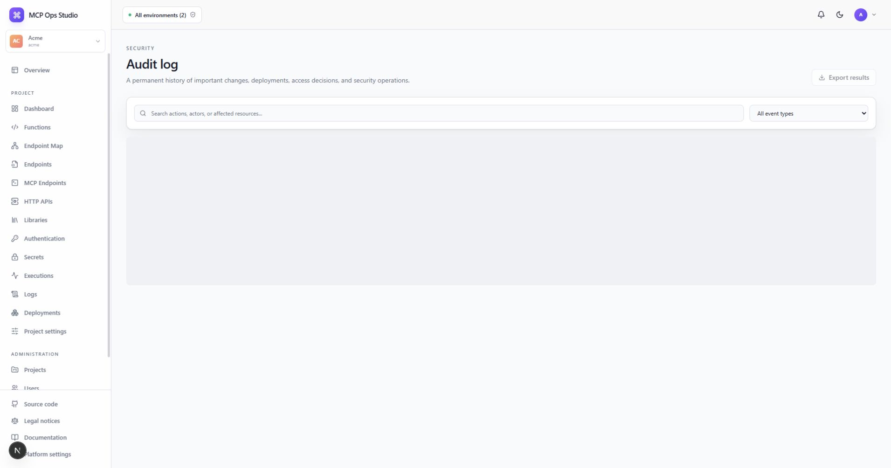

# Audit log

The Audit log records important control-plane, deployment, runtime access, and
security events for the selected Project and installation context.

## Find an event

Filter by action, actor, target type, time, or free text. Each row identifies the
actor, action, target, exact time, request ID, and safe event metadata.

Audit records support operational reviews such as:

- Function, binding, policy, Secret, and endpoint changes.
- Development deployment, Production release, and rollback.
- Project and user administration.
- Authorization and security operations.

Use request IDs to correlate audit entries with [Executions](./executions.md).

## Related guides

- [Executions](./executions.md)
- [Deployments](./deployments.md)
- [Security model](../security.md)
