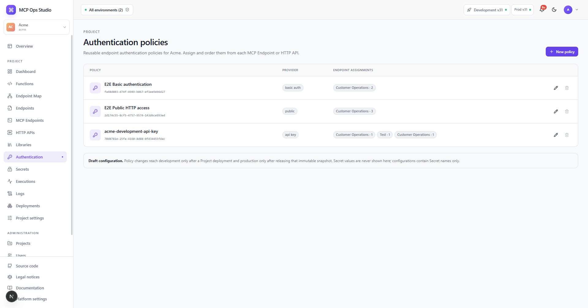

# Authentication

Authentication policies define how callers prove identity and which Function
permissions a successful policy grants. Policies are reusable across MCP
Endpoints and HTTP APIs in the selected Project.

## Policy types

MCP Ops Studio supports public access, API keys, static bearer tokens, HTTP
Basic, JWT with remote JWKS, Microsoft Entra access tokens, and HMAC-SHA256
webhook signatures.

## Create a policy

1. Select **New authentication policy**.
2. Choose the authentication type.
3. Configure type-specific fields such as header name, issuer, audience, JWKS
   URL, signature header, or username.
4. Reference credential values by Project Secret name.
5. Add the Function permissions granted by this policy.
6. Assign and order the policy on each endpoint that uses it.

The runtime evaluates endpoint authentication first, endpoint access second,
and Function permission authorization third. Every outcome receives a request ID
and persisted execution record.

## Related guides

- [Secrets](./secrets.md)
- [Secure an endpoint](../guides/secure-endpoint.md)
- [Audit log](./audit-log.md)
