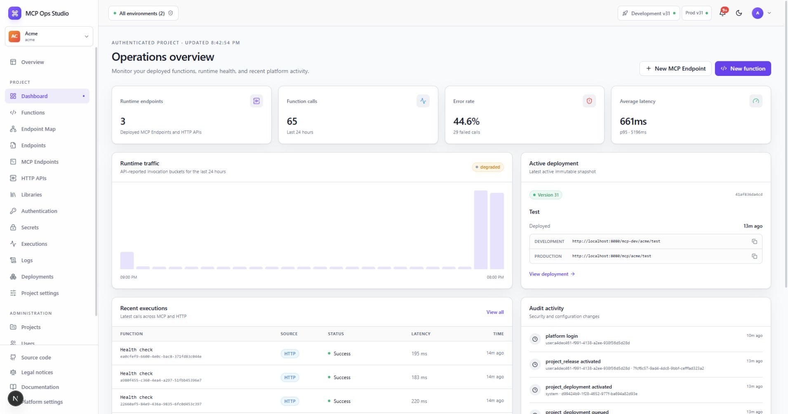

# Dashboard

The Dashboard is the selected Project's operational home. It summarizes
Functions, endpoints, traffic, active deployment, recent executions, and audit
activity.

## Read the dashboard

- Summary cards show the current Function and endpoint inventory.
- Traffic charts show calls and failures over time.
- Active deployment identifies the immutable Development snapshot serving
  runtime traffic.
- Recent executions link operational outcomes to request IDs and Functions.
- Recent audit activity records configuration and security changes.

Use **New Function** to move directly into authoring. Follow **View all** links
for filtered operational history.

## Related guides

- [Functions](./functions.md)
- [Executions](./executions.md)
- [Deployments](./deployments.md)
- [Audit log](./audit-log.md)
