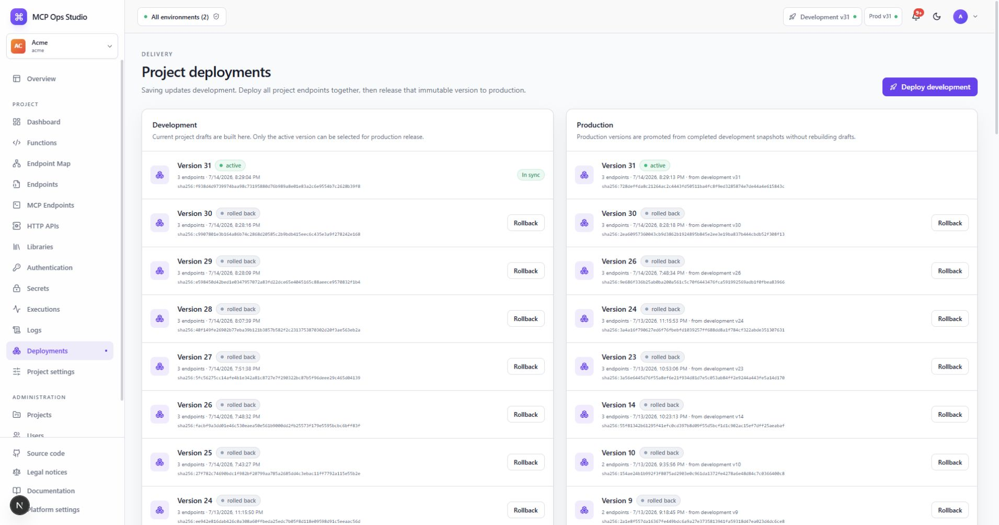

# Deployments

Deployments deliver all Project endpoints and their direct and transitive
Function dependencies as one immutable snapshot.

## Development

Saving Functions, Libraries, bindings, policies, or endpoint settings creates
pending Project changes. **Deploy** queues validation and endpoint build jobs.
The snapshot becomes active after every job completes successfully.

Deployment details show version, status, timestamps, checksums, pinned Functions,
and build information.

## Production

**Release** promotes the selected completed Development snapshot with Production
environment configuration. Promotion preserves the compiled Function versions
and deterministic artifacts from Development.

## Rollback

Select an earlier completed Project deployment and confirm rollback. The worker
restores the complete endpoint artifact set together and writes an immutable
audit event.

## Related guides

- [Release and roll back](../guides/release-and-rollback.md)
- [Executions](./executions.md)
- [Runtime and deployments](../runtime-and-deployments.md)
