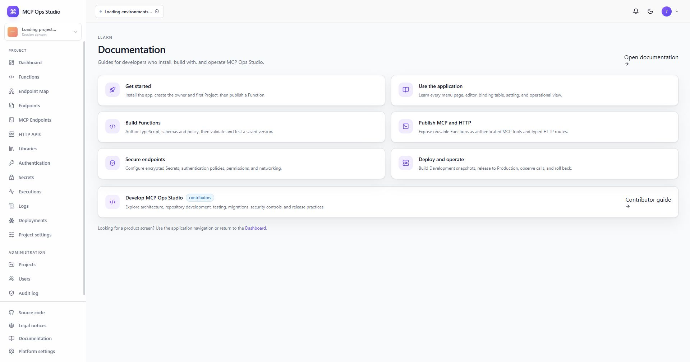

# Documentation

The **Documentation** menu entry opens a task-oriented hub for the canonical MCP
Ops Studio documentation.

The hub separates two paths:

- **Use and operate MCP Ops Studio** covers installation, authoring, endpoint
  delivery, security, observation, maintenance, and upgrades.
- **Develop the platform** covers repository architecture, local development,
  testing, migrations, security controls, and contribution practices.

The VitePress site provides local search, page outlines, previous/next links,
last-updated times, and direct edit links.

## Related guides

- [Getting started](../getting-started.md)
- [Navigation and roles](./navigation.md)
- [Platform development](../contributing/platform-development.md)
