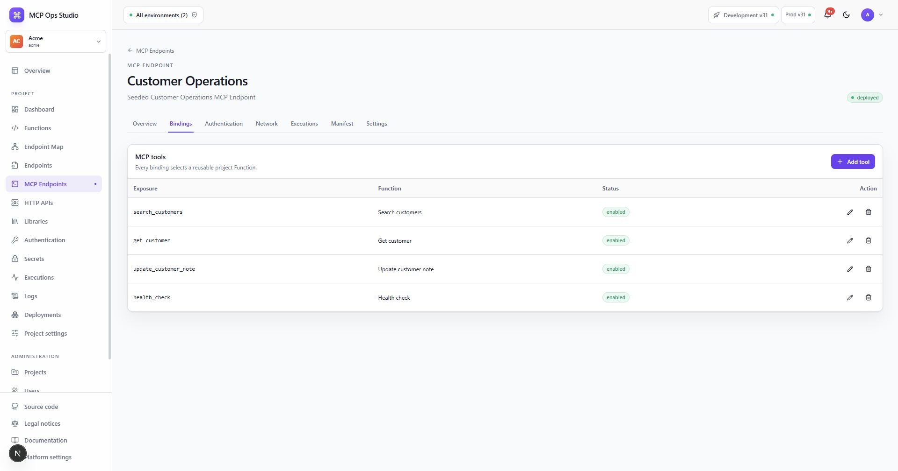

# Endpoint details

MCP Endpoint and HTTP API detail pages use the same seven-tab structure. The
labels and binding fields adapt to the endpoint kind.

## Overview

Review active deployment, bound Function count, calls in the last 24 hours,
authentication mode, and public Development and Production URLs.

## Bindings

Add, edit, enable, disable, or remove tool and route bindings. Binding changes
become runtime configuration with the next completed Project deployment.

## Authentication

Assign reusable authentication policies and order them. Policies are evaluated
in the displayed order. Owners and admins can create a policy and encrypted
credential Secret directly from this tab.

## Network

Configure the outbound hosts, HTTP methods, ports, response limit, and approved
private host entries available to Functions invoked through this endpoint.

## Executions

Inspect calls scoped to this endpoint, including status, duration, request ID,
Function, deployment, and safe error information.

## Manifest

Export the endpoint as YAML, edit the declarative configuration, then validate
and apply it. Manifests contain Secret names and grants.

## Settings

Update the endpoint name, slug, and description. List-page actions also provide
the endpoint lifecycle controls available to the current role.

## Related guides

- [Endpoint Map](./endpoint-map.md)
- [Authentication](./authentication.md)
- [Deployments](./deployments.md)
