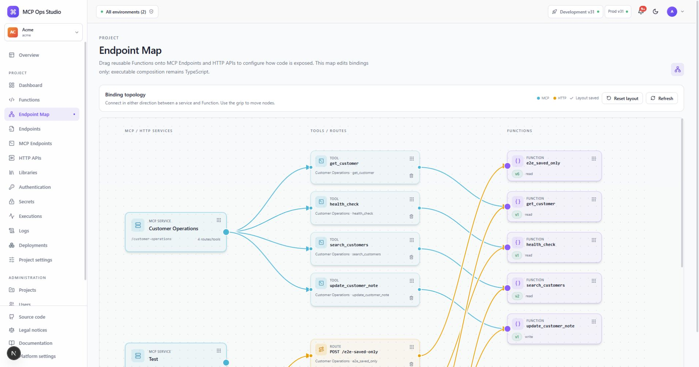

# Endpoint Map

The Endpoint Map is a visual binding editor. Function cards appear beside MCP
Endpoints and HTTP APIs; dragging a Function onto an endpoint creates an
external binding proposal.

## Create a binding

1. Find the Function by name or slug.
2. Drag it onto the target endpoint.
3. Configure the MCP tool name or HTTP method and path.
4. Save the binding.
5. Deploy the Project to activate the new configuration in Development.

The map edits exposure. Function composition remains in TypeScript through
`ctx.functions.call()`.

## Related guides

- [Endpoints](./endpoints.md)
- [MCP Endpoints](./mcp-endpoints.md)
- [HTTP APIs](./http-apis.md)
