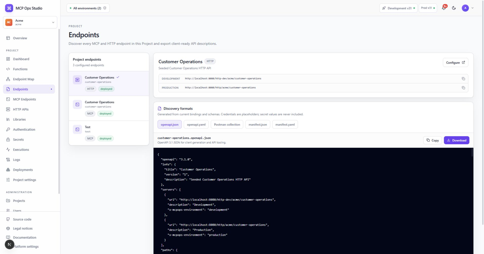

# Endpoints

The Endpoints catalog brings every MCP Endpoint and HTTP API in the selected
Project into one searchable view.

## Explore and export

- Filter endpoints by kind, environment, status, name, or slug.
- Select an endpoint to review its public URLs and bound Functions.
- Open the endpoint detail page for configuration.
- Export the generated client document offered for that endpoint kind.

Generated documents reflect the active endpoint contract and contain Secret
references rather than credential values.

## Related guides

- [MCP Endpoints](./mcp-endpoints.md)
- [HTTP APIs](./http-apis.md)
- [Endpoint details](./endpoint-details.md)
