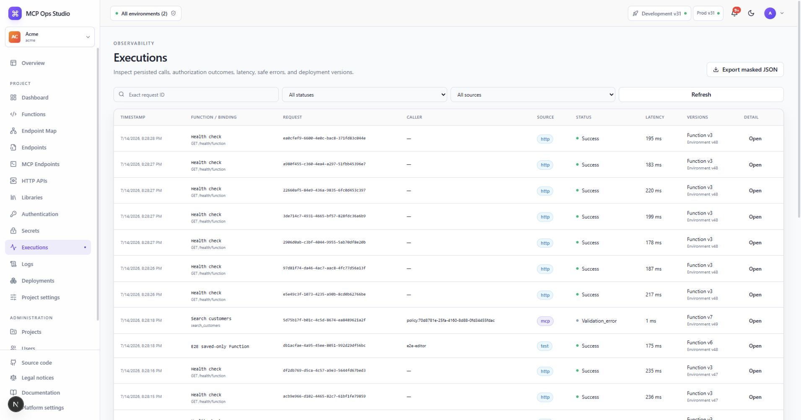

# Executions

Executions provide the Project-scoped runtime history for successful,
validation-error, denied, failed, and timed-out invocations.

## Filter the history

Use status, source, Function, endpoint, and time filters to isolate a request.
Rows show request ID, source, Function, status, duration, deployment, and time.

## Inspect a request

Open an execution to review masked caller, input, output, safe error, logs, and
lineage. Parent and child execution information connects internal
`ctx.functions.call()` activity to the original request.

Use the request ID to correlate the execution with endpoint responses, worker
logs, metrics, and [audit events](./audit-log.md).

## Related guides

- [Dashboard](./dashboard.md)
- [Endpoint details](./endpoint-details.md)
- [Audit log](./audit-log.md)
