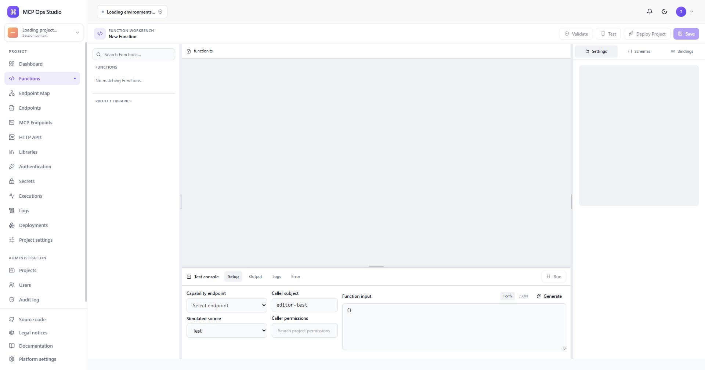

# Functions

A Function is the executable unit in MCP Ops Studio. MCP tools and HTTP routes
bind external names and request shapes to reusable Project Functions.



## Function navigator

The left navigator lists Functions and project Libraries. Search narrows the
list by name or slug. Select a Function to open its source, schemas, policy,
bindings, and saved-version context in the workbench. **New Function** starts a
draft with the standard handler contract.

```ts
export default async function handler(ctx, input) {
  return { ok: true };
}
```

Saving creates an immutable development `FunctionVersion`. Runtime traffic
continues to use the active Project deployment until a new deployment completes.

## Reuse

One Function can back any number of MCP tool and HTTP route bindings. Functions
can also compose other Functions with a literal project slug through
`ctx.functions.call()`.

## Related guides

- [Function editor](./function-editor.md)
- [Endpoint Map](./endpoint-map.md)
- [Build your first Function](../guides/first-function.md)
