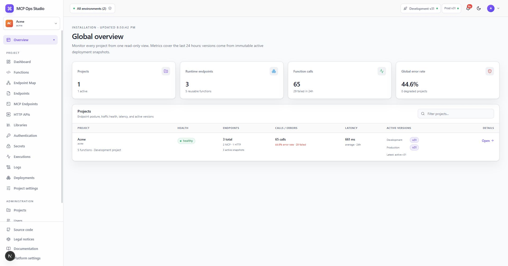

# Global overview

**Global overview** is the installation-wide operational view for owners and
admins. It combines Project health, recent traffic, error rate, and active
Development and Production versions.

## Use the page

1. Review the summary cards for installation-wide activity.
2. Search the Project table by name or slug.
3. Compare active Development and Production versions.
4. Follow a Project link to its endpoints and detailed status.

Traffic covers the time range shown on the page. Deployment versions always
refer to immutable active Project snapshots.

## Related guides

- [Projects](./projects.md)
- [Dashboard](./dashboard.md)
- [Deployments](./deployments.md)
