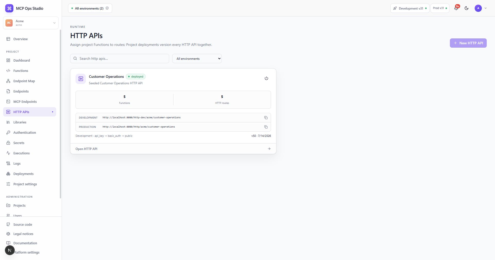

# HTTP APIs

An HTTP API exposes selected Project Functions through explicit method and path
bindings. It shares the same authentication, authorization, validation,
execution, persistence, and audit pipeline as MCP.

## Create an API

1. Select **New HTTP API**.
2. Enter its name, Project-unique slug, and description.
3. Add route bindings from the endpoint detail page or Endpoint Map.
4. Configure authentication and outbound network policy.
5. Deploy the Project.

The runtime URL follows
`/http/{projectSlug}/{endpointSlug}/{bindingPath}`. The endpoint page shows the
exact Development and Production base URLs.

## Route bindings

Each binding selects an HTTP method, path, Function, enabled state, and request
mapping. Path parameters, query values, headers, and JSON bodies are normalized
into the Function input before JSON Schema validation.

## Related guides

- [Endpoint details](./endpoint-details.md)
- [Publish an HTTP route](../guides/http-route.md)
- [Executions](./executions.md)
