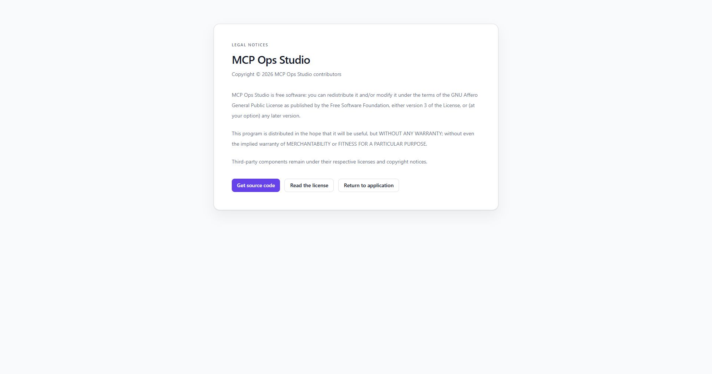

# Legal notices

The Legal notices page identifies the MCP Ops Studio source repository, AGPL-3.0
license, copyright statement, warranty terms, and third-party notices.

The page links directly to the repository license and source. Installation
operators can use these links when preparing their own service notices and
source-code offer.

## Related resources

- [Source code](./source-code.md)
- [Repository license](https://github.com/fabian-arnold/McpOpsStudio/blob/main/LICENSE)
- [Third-party notices](https://github.com/fabian-arnold/McpOpsStudio/blob/main/THIRD_PARTY_NOTICES.md)
