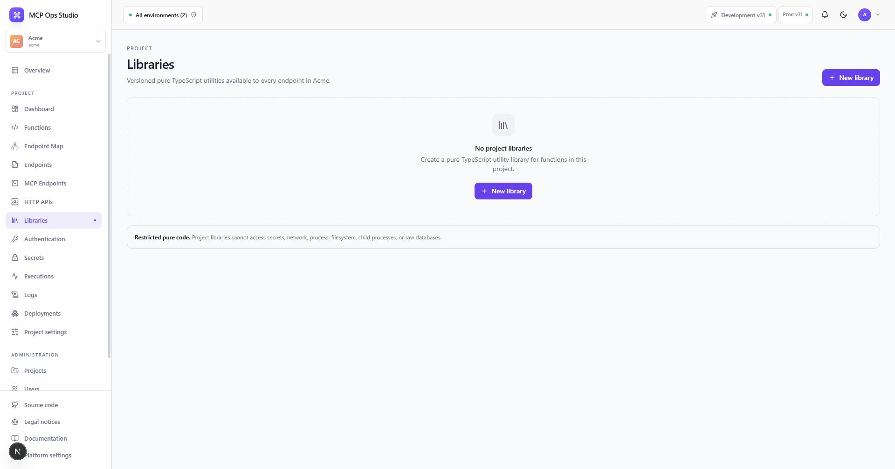

# Libraries

Project Libraries provide reviewed, versioned TypeScript utilities to every
Function in the selected Project.



## Create a Library

1. Select **New Library**.
2. Choose a stable slug used by the import specifier.
3. Write exported pure TypeScript functions in Monaco.
4. Use the export editor to keep the declared API clear.
5. Save to create an immutable Library version.

Import a Library from a Function with its project-local module name:

```ts
import { normalizeCustomer } from "@mcpops/lib/customer-utils";
```

Deployment resolves the Library version consumed by each Function and pins it
into the immutable Project snapshot.

## Related guides

- [Function editor](./function-editor.md)
- [Deployments](./deployments.md)
