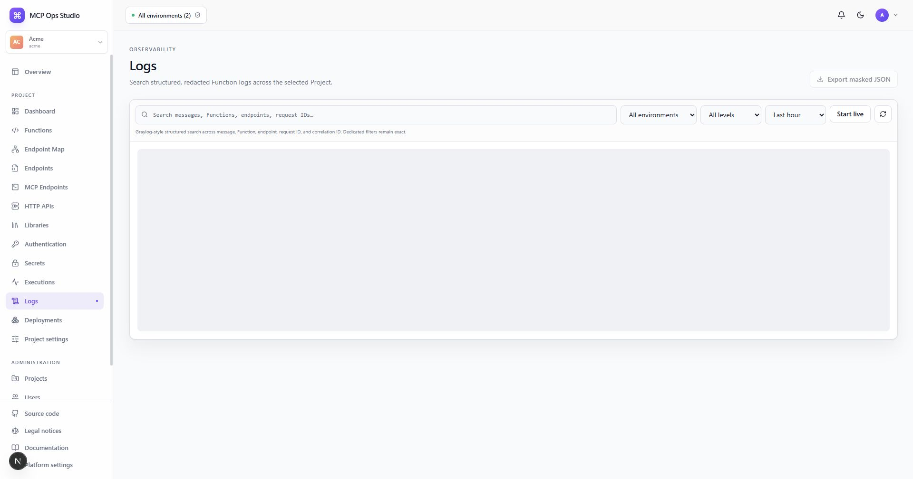

# Logs

The Logs page provides Graylog-style search across structured Function messages
retained for the selected Project.

## Search and filter

- Search messages, Function and endpoint names, request IDs, and correlation IDs.
- Filter by environment, log level, and time range.
- Use **Start live** to refresh the current result every five seconds.
- Refresh on demand or load older messages with cursor pagination.

The summary reports matching message count, retained size, and the distribution
of debug, info, warning, and error levels.

## Inspect and export

Expand a row to inspect masked metadata, execution ID, deployment ID, and stored
size. Function names link to the corresponding editor. **Export masked JSON**
downloads the currently loaded result set for local analysis.

Request and correlation IDs connect logs to [Executions](./executions.md), while
deployment IDs connect them to [Deployments](./deployments.md).

## Related guides

- [Executions](./executions.md)
- [Dashboard](./dashboard.md)
- [Deployments](./deployments.md)
