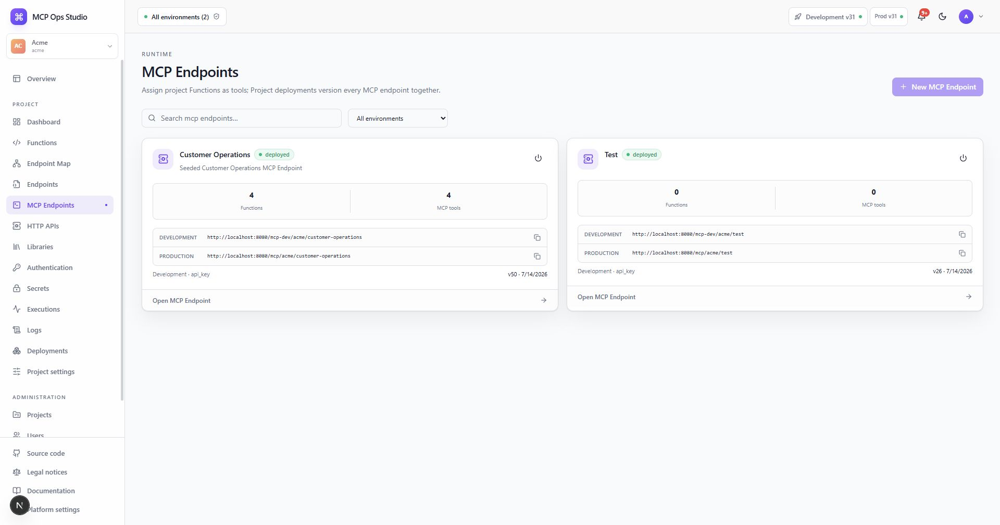

# MCP Endpoints

An MCP Endpoint exposes selected Project Functions as MCP tools. Each endpoint
has its own slug, authentication chain, outbound network policy, and binding
table.

## Create an endpoint

1. Select **New MCP Endpoint**.
2. Enter a name, Project-unique slug, and description.
3. Choose the environment context presented by the dialog.
4. Open the endpoint and add tool bindings.
5. Assign authentication and configure the network policy.
6. Deploy the Project to Development.

The runtime URL follows `/mcp/{projectSlug}/{endpointSlug}` through the public
gateway. The page displays the exact Development and Production URLs for the
installation.

## Tool bindings

A tool binding selects a Function and supplies its MCP tool name and description.
The Function input schema becomes the tool input schema returned by `tools/list`.

## Related guides

- [Endpoint details](./endpoint-details.md)
- [Publish an MCP tool](../guides/mcp-tool.md)
- [Authentication](./authentication.md)
