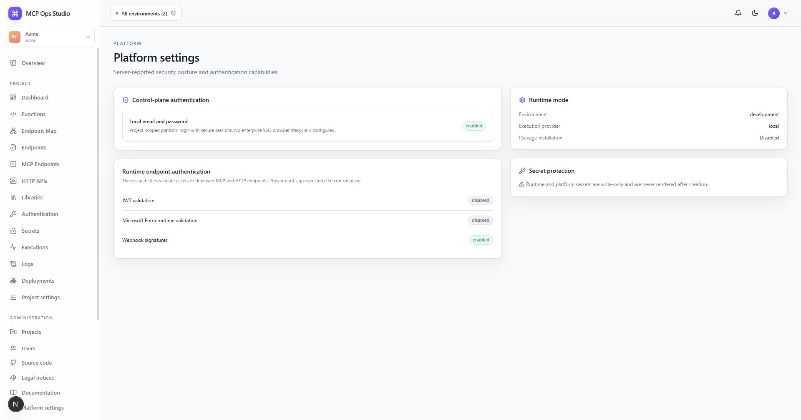

# Platform settings

Platform settings present the capabilities reported by the control-plane server
for the current installation.

The page summarizes authentication, security, runtime, and integration
capabilities using values supplied by the server. Operators can compare this view
with installation configuration after deployment or upgrade.

Capability states are read-only and describe the running installation. Follow
the linked operational guide for the corresponding environment configuration.

## Related guides

- [Installation](../installation.md)
- [Security model](../security.md)
- [Project settings](./project-settings.md)
