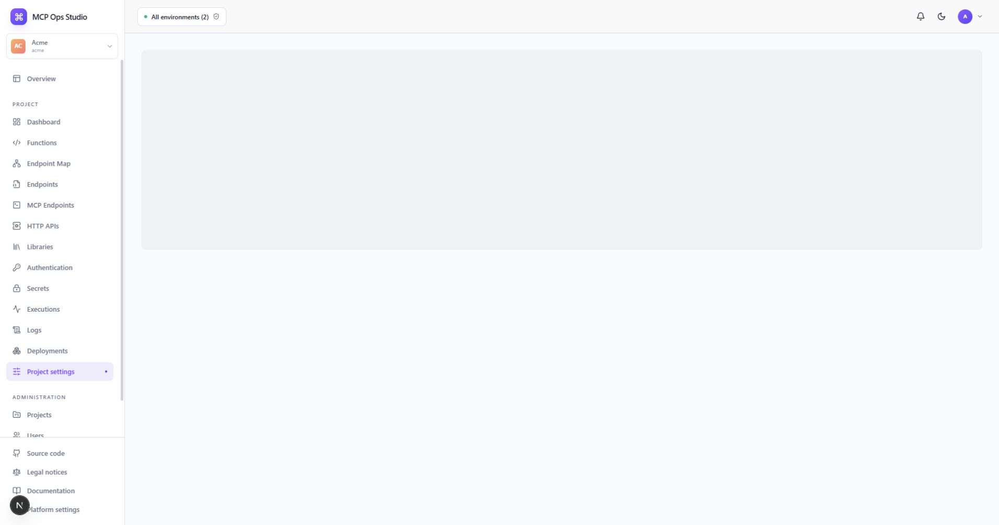

# Project settings

Project settings control the selected Project's identity and Development
diagnostic behavior.

## General settings

Owners and admins can update the Project name, stable slug, and description.
The slug participates in public MCP and HTTP runtime URLs.

## Development diagnostics

Configure the Project's Development logging and execution display options. The
page explains how the selected values affect newly recorded diagnostic data.

## Project lifecycle

The lifecycle section provides the archive and deletion operations supported for
the current Project state. Confirmation dialogs state the affected resources and
required Project conditions.

## Related guides

- [Projects](./projects.md)
- [Deployments](./deployments.md)
- [Platform settings](./platform-settings.md)
