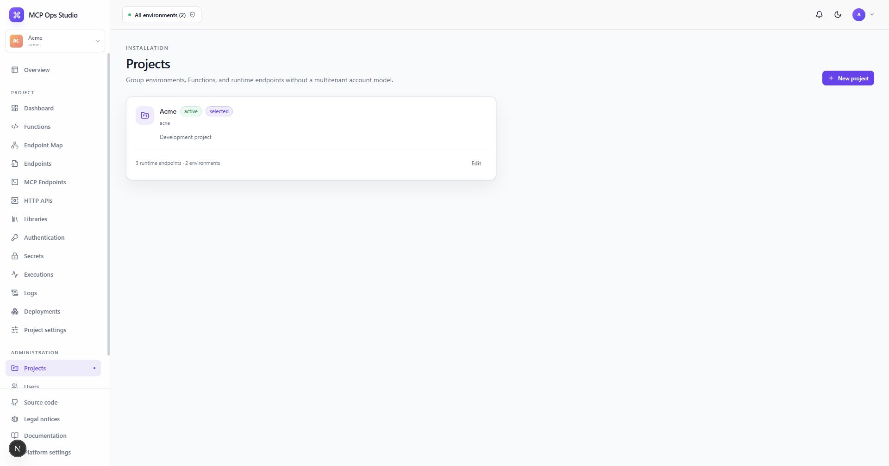

# Projects

Projects own reusable Functions, environments, endpoint configuration, Secrets,
Authentication policies, Libraries, deployments, and operational history.

## Create a Project

Owners and admins select **New project**, then provide a name, unique slug, and
description. Open a Project to review its runtime endpoints. Select it from the
application project switcher to perform Project-scoped work.

## Lifecycle

Active Projects participate in authoring and runtime operations. Archiving
preserves history and records the lifecycle change. The Projects screen presents
the available restore or final cleanup action for each state.

## Related guides

- [Global overview](./global-overview.md)
- [Project settings](./project-settings.md)
- [Audit log](./audit-log.md)
