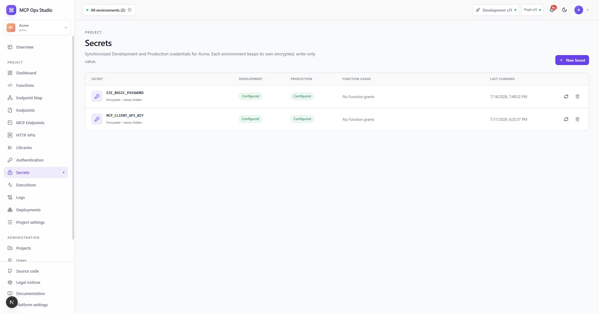

# Secrets

The Secrets page manages Project credential names with independent encrypted
values for Development and Production.

## Create or rotate a Secret

1. Select **New project Secret**, or choose **Rotate** on an existing name.
2. Enter the uppercase Secret name.
3. Enter separate Development and Production values.
4. Save both environment values atomically.

Values are write-only in the control plane. The UI reports presence and update
time while runtime access occurs through `ctx.secrets.get()` for names granted
to the Function.

Use Secrets for endpoint credentials and Function access to upstream systems.
Deployments store grants and references so the worker resolves the appropriate
environment value at invocation time.

## Related guides

- [Authentication](./authentication.md)
- [Function editor](./function-editor.md)
- [Secure an endpoint](../guides/secure-endpoint.md)
