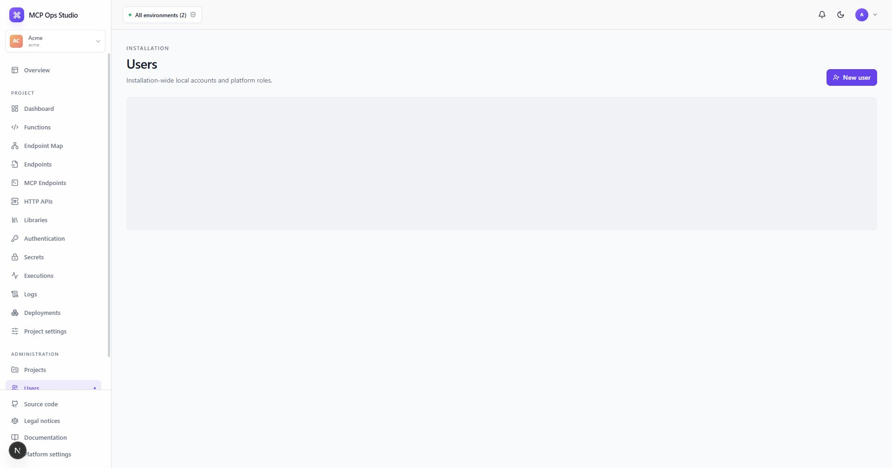

# Users

The Users page manages local accounts for the whole MCP Ops Studio installation.
Each active user has one installation-wide role and works in the Project selected
in their signed session.

## Create a user

1. Select **New user**.
2. Enter the email address.
3. Set a temporary password of at least 12 characters.
4. Choose owner, admin, developer, operator, or viewer.
5. Share the temporary credential through your established secure channel.

The user changes the temporary password after signing in. Owners can update
roles, remove access, and restore access. The active-owner safeguard keeps an
owner available for installation administration.

## Related guides

- [Navigation and roles](./navigation.md)
- [Installation and account](./account-and-setup.md)
- [Audit log](./audit-log.md)
