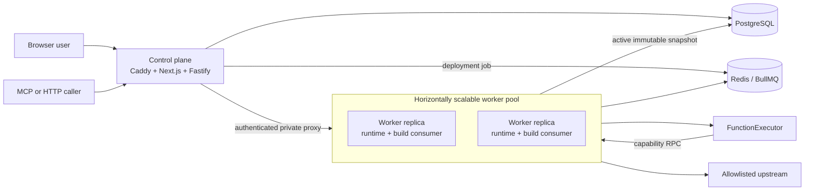

# Architecture

MCP Ops Studio is a function-first platform. A project-level Function owns code,
schemas and policy requirements and may be reused by any MCP Endpoint or HTTP API
in the Project.
MCP tools and HTTP routes bind external names and request shapes to Functions;
bindings do not contain executable implementations.

The application ships as two deployable roles. PostgreSQL and Redis remain
supporting infrastructure.



## Deployable roles

### Control plane

The `control-plane` role packages Caddy, `apps/web` and `apps/api`. It owns the
public ports, local authentication, signed sessions, CSRF enforcement, platform
RBAC, project-scoped CRUD, manifests, deployment requests and rollback. Caddy
serves the UI and API and proxies `/mcp` and `/http` to the private worker pool.

Static source validation is allowed here. User-authored code must never execute
in this role.

### Worker

The `worker` role packages `apps/runtime` and `apps/worker`. Every identical
replica can accept private runtime requests and consume deployment jobs, using
separate runtime and build concurrency limits. Replicas are stateless apart from
PostgreSQL and Redis and can be scaled with:

```bash
docker compose -f infra/docker-compose.yml up --build --scale worker=3
```

The private runtime resolves active snapshots, validates requests, invokes
`FunctionExecutor`, and persists executions and audits. The build consumer
validates schemas and restricted imports, bundles ESM, resolves immutable
Function and library versions, and atomically activates valid snapshots.

Worker ports are not published. Proxied MCP/HTTP requests carry the original
request/correlation identifiers and an internal credential. Workers reject
missing or invalid invocation authentication and expose private readiness checks
for load balancing.

### Executor

`packages/sandbox` defines `FunctionExecutor` and the local child-process
implementation. The child receives serialized metadata and calls privileged
capabilities over IPC. It does not receive a normal process environment or raw
storage, network, secret, database or Redis clients.

The local executor is appropriate only for trusted developers. Production can
select the disposable-container provider without changing the invocation
contract; provider selection is explicit and fail-closed.

## Reusable Functions and typed endpoints

Functions belong to a Project. MCP Endpoints and HTTP APIs are independent
security and deployment boundaries that select project Functions through
protocol-specific bindings. Editing a shared Function does not modify running
endpoints. Each endpoint must be explicitly deployed to pin the new immutable
Function version.

Code may compose Functions through the controlled capability:

```ts
const order = await ctx.functions.call("get_order", { orderId: input.orderId });
return ctx.functions.call("create_ticket", {
  subject: `Order ${order.number}`,
});
```

Call targets must be literal project Function slugs. Deployment resolves and
pins the transitive call graph, rejects cycles, and fails if a target cannot be
resolved. Internal calls use the child Function's own schema, timeout, secret,
network, storage and cache policies. Runtime enforces a maximum depth of eight
and records parent/root execution lineage.

MCP Endpoint and HTTP API pages use ordinary binding tables. The Endpoint Map is
a dedicated drag-and-drop topology for assigning Function nodes to MCP Endpoint
and HTTP API nodes. It does not compose executable steps: Function composition
remains TypeScript and there is no workflow canvas.

## Data ownership

PostgreSQL is authoritative for projects, users, environments, reusable
Functions and versions, MCP Endpoints, HTTP APIs, bindings, policies, encrypted secrets,
deployments, durable storage, executions and audits. Redis is used for BullMQ
and scoped runtime cache; cached data is not authoritative.

Public runtime routing uses project and typed endpoint slugs. All control-plane
lookups derive project scope from the authenticated session. Function slugs and
endpoint slugs are unique within a Project and endpoint kind.

## Dependency direction

```text
control-plane role: apps/web + apps/api + Caddy
worker role:        apps/runtime + apps/worker
apps/api -> shared + db + sandbox bundler
apps/runtime -> db + runtime-sdk + sandbox
apps/worker -> shared + db + sandbox bundler
packages/sandbox -> runtime-sdk + platform-modules
```

Avoid importing one application from another. Role composition happens at the
container/process boundary; cross-role communication uses authenticated private
HTTP, queues and persisted state.

## Key invariants

- Draft Function code is never served as runtime traffic.
- Deployments pin immutable direct and transitive Function versions.
- Bindings expose Functions; they do not contain executable code.
- User code executes only behind `FunctionExecutor` in the worker role.
- Secret values are resolved at invocation time and never snapshotted.
- Every invocation has safe identifiers and a persisted, redacted outcome.
- Audit records are append-only.
