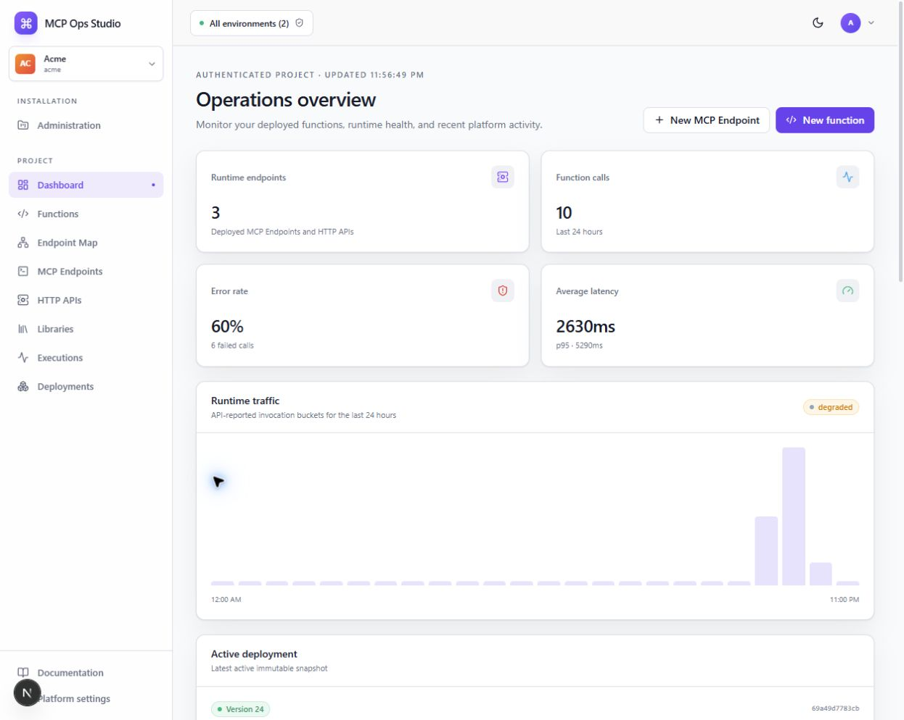
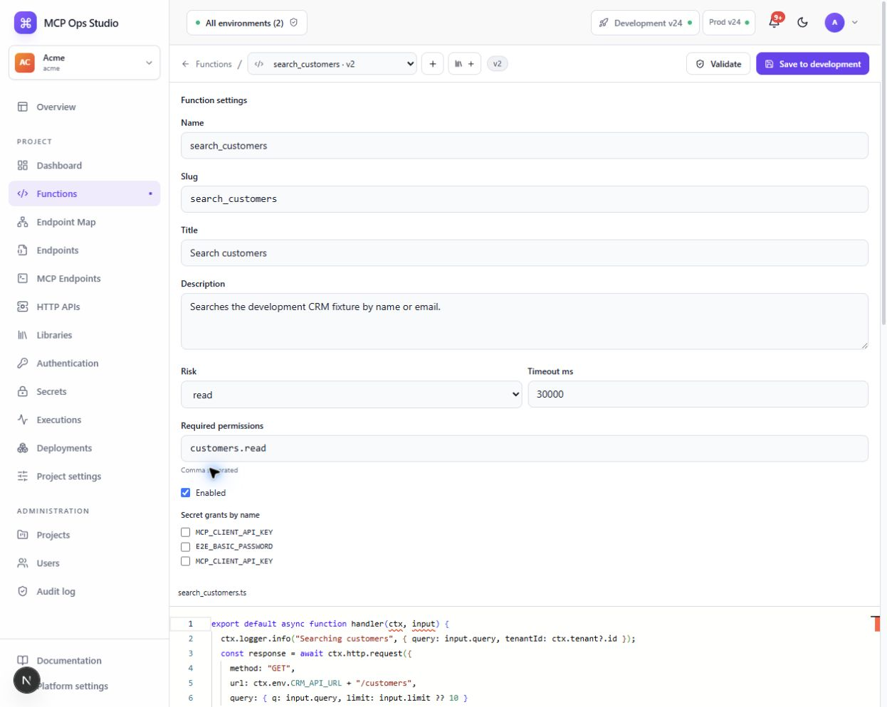
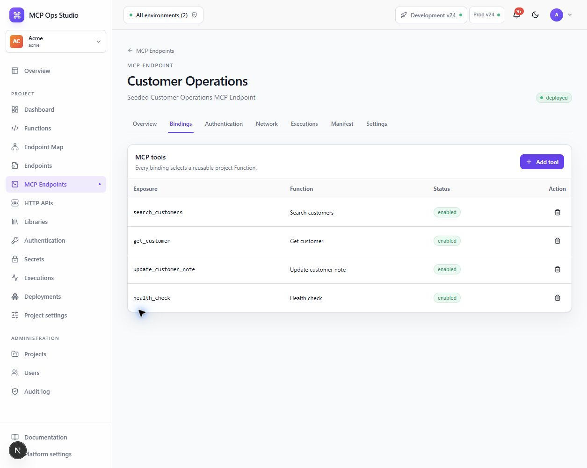

# MCP Ops Studio

MCP Ops Studio is a self-hosted, code-first platform for building reusable
TypeScript Functions and exposing immutable deployments through MCP tools and
HTTP routes.

::: info Function-first by design
A `Function` is the executable unit. MCP tools and HTTP routes are bindings to a
Function, not separate implementations. Function composition stays in
TypeScript through `ctx.functions.call()`.
:::

## Start here

| If you want to…                                                 | Read…                                                   |
| --------------------------------------------------------------- | ------------------------------------------------------- |
| Understand the system boundaries and deployable roles           | [Architecture](./architecture.md)                       |
| Run the stack or contribute code                                | [Development](./development.md)                         |
| Learn how versions, snapshots, releases, and rollback work      | [Runtime and deployments](./runtime-and-deployments.md) |
| Review authentication, secrets, isolation, and network controls | [Security model](./security.md)                         |
| Integrate with the control plane                                | [Control-plane API](./api.md)                           |

## Quick start

You need Node.js 22 or newer, pnpm 9 through Corepack, and Docker Compose v2.

```bash
git clone https://github.com/fabian-arnold/McpOpsStudio.git
cd McpOpsStudio
corepack enable
pnpm install
pnpm db:generate
cp .env.example .env
pnpm dev
```

Open `http://localhost:8080` and sign in with the development-only seed account:

```text
Email:    admin@acme.test
Password: ChangeMe123!
```

The watched Compose stack synchronizes application source, runs the control
plane and worker roles, and preserves PostgreSQL and Redis development data.

## Programming model

Every invocation converges on the same handler contract:

```ts
export default async function handler(ctx, input) {
  const customer = await ctx.functions.call("get_customer", {
    customerId: input.customerId,
  });

  return { ok: true, customer };
}
```

Functions receive a restricted runtime context for logging, outbound HTTP,
secrets, storage, cache, audits, reviewed database queries, and internal
Function calls. They do not receive ambient filesystem, process, shell,
environment, or unrestricted network access.

### Core concepts

| Concept                | Responsibility                                                                                |
| ---------------------- | --------------------------------------------------------------------------------------------- |
| **Project**            | Owns Functions, environments, operational resources, and endpoint configuration.              |
| **Function**           | Reusable TypeScript implementation with schemas, policy, permissions, and immutable versions. |
| **MCP Endpoint**       | Exposes selected project Functions as MCP tools through a binding table.                      |
| **HTTP API**           | Exposes selected project Functions as typed HTTP routes through a binding table.              |
| **Project deployment** | Pins direct and transitive Function versions into one immutable development snapshot.         |
| **Production release** | Promotes a completed development snapshot with production environment configuration.          |
| **FunctionExecutor**   | The only boundary through which user-authored code may execute.                               |

## Runtime at a glance

Public traffic enters the `control-plane` role. MCP and HTTP invocations are
forwarded over an authenticated private hop to the scalable worker pool, where
the runtime resolves the active snapshot and invokes `FunctionExecutor`.

```text
Browser / MCP / HTTP caller
            │
            ▼
 control-plane role
 Caddy + Next.js + Fastify
            │ authenticated private invocation
            ▼
 worker role (horizontally scalable)
 runtime + deployment worker + FunctionExecutor
            │
            ├── PostgreSQL: durable state and snapshots
            └── Redis: deployment jobs and scoped cache
```

Draft source is never served by runtime routes. A deployment becomes active
only after every endpoint artifact builds successfully, so a failed build
cannot partially replace live traffic.

## Control plane

The dashboard connects operational health, Function authoring, endpoint
configuration, deployments, executions, and audit activity within the selected
Project.



### Author reusable Functions

The Function editor keeps source, schemas, policy, secret grants, validation,
and development testing together. Saving creates an immutable
`FunctionVersion`; it does not change active traffic.



### Bind Functions to protocol surfaces

Endpoint pages use explicit tables. A binding selects a reusable Function and
defines its external MCP tool or HTTP route name without introducing another
executable implementation.



## Deployment guarantees

1. Save immutable Function and project-library versions.
2. Queue one development Project deployment and its endpoint builds.
3. Validate schemas, policies, permissions, imports, and the transitive call graph.
4. Bundle restricted ESM artifacts and calculate deterministic checksums.
5. Activate all endpoint artifacts atomically after every build succeeds.
6. Promote only a completed development snapshot to production.
7. Roll back the entire Project to an earlier completed snapshot when required.

See [Runtime and deployments](./runtime-and-deployments.md) for the complete
snapshot contract, call-graph behavior, invocation pipeline, and rollback model.

## Security boundaries

- Platform mutations require session authentication, project scoping, role
  authorization, and CSRF validation.
- Runtime authorization separately enforces endpoint authentication, endpoint
  access, and Function permissions.
- Secret values are encrypted with AES-256-GCM and never returned from normal
  APIs or stored in snapshots, logs, audits, or execution displays.
- Outbound HTTP enforces DNS and private-address checks, allowlists, redirect
  revalidation, timeouts, response limits, and sanitized errors.
- Callers receive safe runtime error codes without stack traces or upstream
  response bodies.

Read the [Security model](./security.md) before changing authentication,
authorization, secrets, sandboxing, networking, tenancy, or redaction.

## Repository map

```text
apps/web                 Next.js control-plane UI and Monaco editor
apps/api                 Fastify control-plane API, sessions, CSRF and RBAC
apps/runtime             Private MCP/HTTP runtime and invocation pipeline
apps/worker              BullMQ validation and snapshot builder
packages/shared          Contracts, manifests, templates and shared security
packages/db              Prisma client, project scopes and durable storage
packages/runtime-sdk     RuntimeContext, safe errors and authorization
packages/platform-modules Reviewed virtual module source
packages/sandbox         Restricted bundler and FunctionExecutor providers
prisma                   Schema, migrations and development seed
infra                    Two-role Compose deployment and Caddy gateway
```

## Current scope

Version 1 supports initialization and tools over MCP plus JSON HTTP bindings.
Prompts, resources, schedules, event buses, arbitrary npm packages, raw database
queries, generic gateway middleware, response streaming, enterprise
control-plane SSO, and Microsoft Agent 365 integration are intentionally not
presented as production-complete features.
