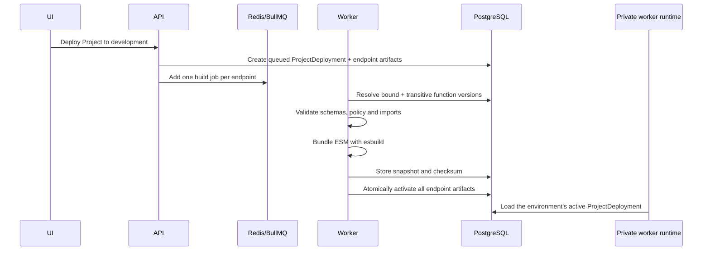

# Runtime and Deployments

## Function lifecycle

A project-level `Function` contains stable editable metadata. Each source save
that changes code creates an immutable `FunctionVersion`. MCP Endpoints and HTTP
APIs reuse Functions through protocol-specific bindings that reference the
stable Function ID.

A Function may be exposed by multiple MCP Endpoints and HTTP APIs, or by neither.
Editing it does not affect runtime traffic until the Project is deployed to
development and that immutable Project version is optionally released to
production.

The editor workflow is **save to development → test → deploy Project**. Testing
compiles the latest saved immutable FunctionVersion in the control plane, then
sends the artifact to the private runtime for execution through
`FunctionExecutor`. A selected development endpoint supplies environment
capabilities (secrets, network policy, storage, and cache), but its deployed
Function artifact is not used. This also allows an unbound Function to be tested.
Public MCP and HTTP routes continue to execute only active Project snapshots.

Execution records store both the exact Function version and the capability
endpoint's deployment version, so pre-deployment tests remain auditable.

## Deployment lifecycle



Activation happens only after every endpoint and enabled Function has built
successfully. A failed artifact records logs and leaves the complete previous
Project deployment unchanged.

Production release copies a completed development Project snapshot, applies the
production environment configuration, and never reads current drafts or
rebuilds source. Rollback changes the environment's active Project deployment
and all endpoint pointers together. It does not rebuild old code.

## Snapshot contents

Snapshots contain immutable references and deploy-time configuration:

- Function and function-version identifiers
- The resolved transitive internal-call graph
- Compiled ESM, checksums and JSON Schemas
- Risk level and required permissions
- Secret references, never values
- MCP and HTTP bindings
- Project library versions and bundled source
- Authentication policy configuration
- Network policy
- Safe runtime environment values

The runtime validates snapshot structure when loading it. This unreleased
baseline does not maintain compatibility with snapshots created before the
project-level Function model; reset and reseed development data after upgrading.

## Invocation pipeline

MCP and HTTP normalize to the same internal request:

```text
endpoint + active deployment + function + caller + input + source
```

The pipeline performs:

1. Endpoint authentication
2. Endpoint resolution and access
3. Function permission authorization
4. Input JSON Schema validation
5. Secret grant resolution
6. RuntimeContext construction
7. Child-process execution with timeout and cancellation
8. Optional output JSON Schema validation
9. Redacted execution persistence
10. Audit persistence

Public requests reach Caddy in the control-plane role and are forwarded to a
private worker replica. The proxy preserves request and correlation IDs and
authenticates with `INTERNAL_API_TOKEN`. Worker ports are not public, and the
worker revalidates the active immutable snapshot and normalized request before
execution.

## Internal Function calls

Functions compose reusable project logic in TypeScript:

```ts
const ticket = await ctx.functions.call("read_ticket", {
  ticketId: input.ticketId,
});
```

Only literal Function slugs are supported. Deployment discovers calls, resolves
the complete graph to immutable versions, and rejects missing targets, dynamic
targets and cycles. Internal calls:

- validate child input and optional output schemas;
- use the child Function's timeout and capability policies;
- propagate caller, tenant, correlation, cancellation and remaining timeout;
- record `invocationSource: internal`, `parentExecutionId` and `rootExecutionId`;
- fail with safe, redacted errors that ordinary TypeScript may catch; and
- stop at a maximum nesting depth of eight.

## MCP

The endpoint is:

```text
POST /mcp/{projectSlug}/{endpointSlug}
```

Production uses `/mcp`; development uses the isolated
`/mcp-dev/{projectSlug}/{endpointSlug}` path.

The implementation is stateless and validates protocol requests with the official TypeScript MCP SDK schemas. Version 1 advertises tools only.

`tools/list` returns enabled bindings from the active snapshot. `tools/call` validates the bound function's input before execution and returns safe structured content.

## HTTP bindings

The endpoint prefix is:

```text
/http/{projectSlug}/{endpointSlug}
```

Production uses `/http`; development uses the isolated
`/http-dev/{projectSlug}/{endpointSlug}` path.

Routes support GET, POST, PUT, PATCH and DELETE with simple `:parameter` segments. Input mappings may reference path, query, headers and body. Without a mapping, these sources are merged into the function input.

## Controlled capabilities

The executor exposes only capability objects on `RuntimeContext`:

- Explicitly granted secret lookup
- Policy-restricted HTTP
- Namespaced durable storage
- Namespaced Redis cache
- Structured redacted logger
- Append-only audit writer
- Feature-gated reviewed database query interface
- Typed project Function calls
- Abort signal

The child communicates privileged operations back to the parent process over IPC. Do not pass raw clients, master keys, database URLs or unrestricted environment variables into the child.
